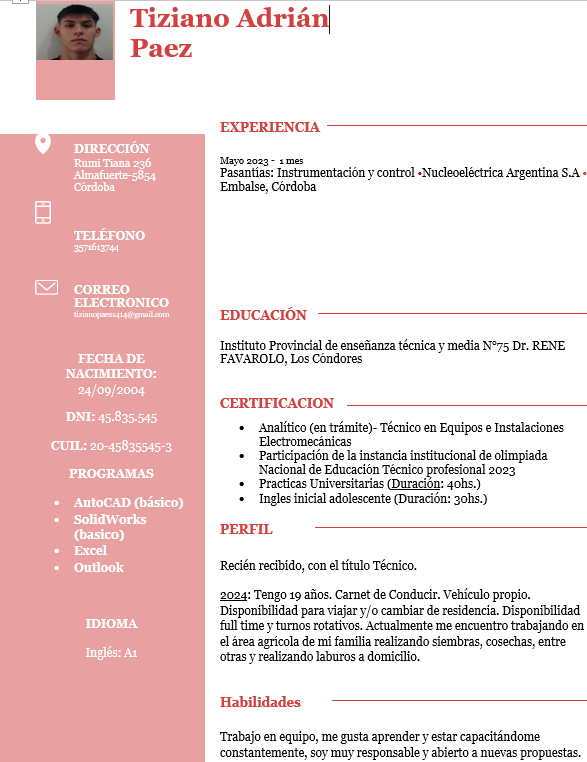

# Logo

 Profesor: Vera Cristian Gonzalo.

Alumno: Paez Tiziano Adrian.
##
# Estructura de monorepositorio:

 ## TP#1.Introduccion IoT
 ## TP#2.Fundamentos de Programación IoT y Módulos de Desarrollo Objetivos
 ## TP#3.Transductores binarios
 ## TP#4
 

## Resumen del repositorio actual TP#4.
_Objetivos
• Afianzar fundamentos de programación en C/C++
• Afianzar fundamentos de herramientas de desarrollo (
simuladores, ide)
• Afianzar fundamentos de sensores y actuadores básicos.
##
# Perfil del alumno
 

